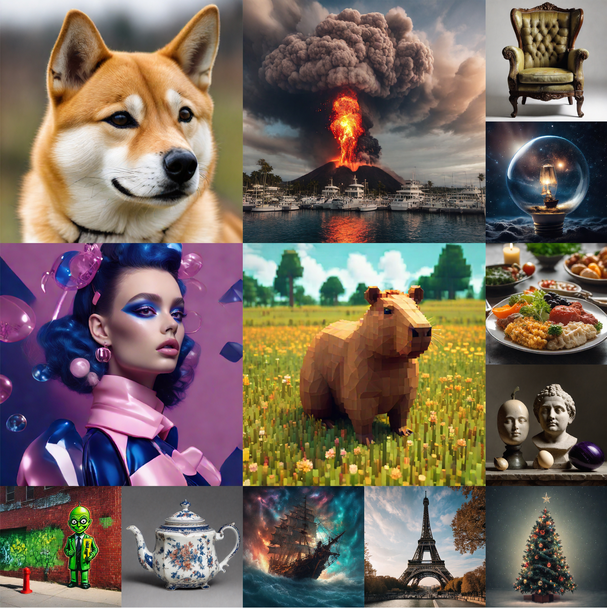
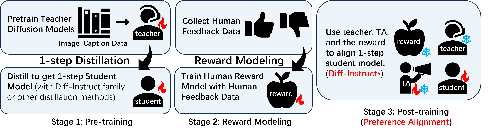
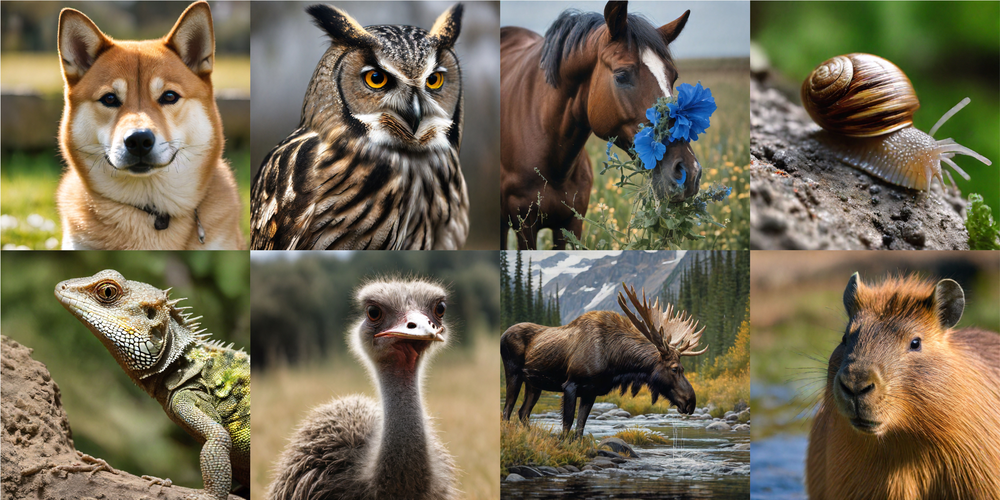
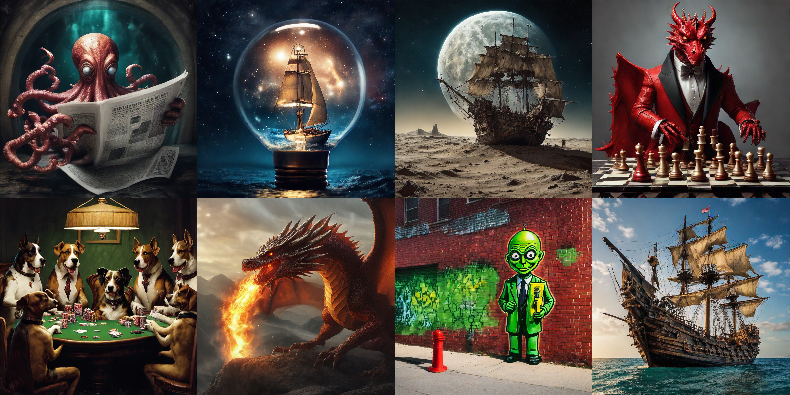
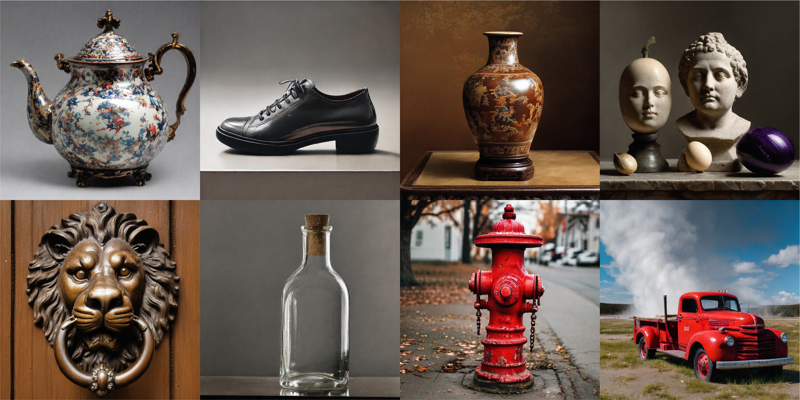
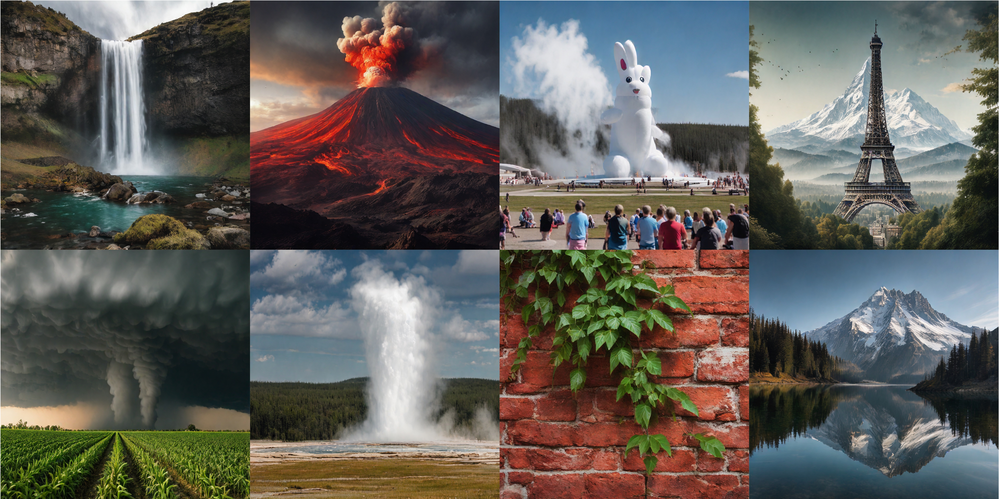
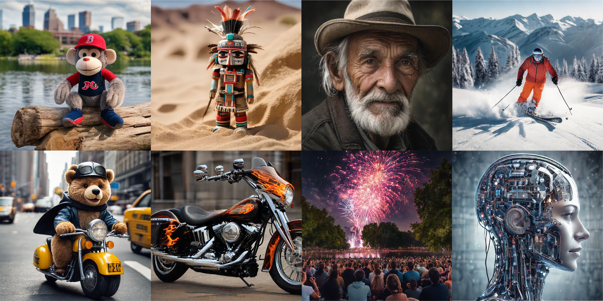

# Diff-Instruct\*: Towards Human-Preferred One-Step Text-to-Image Generative Models

Welcome to the official repository for **Diff-Instruct\*** (DI*), a state-of-the-art framework for training one-step text-to-image generative models that align with human preferences while maintaining exceptional image quality and diversity. This work introduces novel techniques to enhance human preference alignment in text-to-image generation through **score-based RLHF**.

**DI\*-SDXL-1step** model is a leading human-preferred 1024x1024 text-to-image generative model that outperforms FLUX-dev-50step with only **1.88% inference time** and **29.30% GPU memory cost** on Parti and HPSv2.1 benchmarks. 



## Highlights

- **One-Step Text-to-Image Generation**: The DI*-SDXL-1step model generates high-resolution images (1024 × 1024) in a single forward pass, achieving unprecedented efficiency and performance.
- **Human Preference Alignment**: Uses reinforcement learning with human feedback (RLHF) and a novel score-based divergence regularization for better alignment with human preferences.
- **Efficiency**: Outperforms leading models with only **1.88% inference time** and **29.30% GPU memory cost** compared to multi-step diffusion models.
- **State-of-the-Art Performance**:
  - **Parti Prompt Benchmark**: Sets new records in PickScore, ImageReward, and CLIPScore.
  - **HPSv2.1 Benchmark**: Achieves a record-breaking human preference score of 31.19.
- **Open Source**: Industry-ready model available for public use.

## The Diff-Instruct Family

Before [Diff-Instruct\*](https://arxiv.org/abs/2410.20898), [Diff-Instruct](https://arxiv.org/abs/2305.18455) is a diffusion distillation approach that distills pre-trained diffusion models into 1-step generative models by minimizing an integral KL divergence. 

[Score-implicit Matching](https://arxiv.org/abs/2410.16794) developed a technique that distills into 1-step generative models by minimizing a general family of score-based divergences, which improves the distillation diversity than Diff-Instruct. 

[Flow Generator Matching](https://arxiv.org/abs/2410.19310) further generalizes the general score-based divergence to Flow Matching Models. 

[Diff-Instruct++](https://arxiv.org/abs/2410.18881) generalized Diff-Instruct to RLHF by introducing human reward through the lens of online PPO, showing surprising performances for preference alignment of 1-step text-to-image models. 

Inspired by Diff-Instruct++, [Diff-Instruct\*](https://arxiv.org/abs/2410.20898) introduced a score-based RLHF approach, together with DI\*-SDXL-1step model, a record-breaking 1-step model aligned with human preferences while maintaining strong generation diversities. 

In this project, we implement Diff-Instruct family models based on [DMD2](https://github.com/tianweiy/DMD2) as the initial 1-step model. We show that tough SIM, Diff-Instruct++, and Diff-Instruct show decent performances, Diff-Instruct\* results in the best human-preference-aligned model, the **DI\*-SDXL-1step model**, which outperforms current leading diffusion models such as [FLUX-dev](https://huggingface.co/black-forest-labs/FLUX.1-dev) by [Black Forest Lab](https://blackforestlabs.ai/) and [SD3.5-large](https://huggingface.co/stabilityai/stable-diffusion-3.5-large) by [Stability AI](https://stability.ai/). 


## How Diff-Instruct\* Works



The Diff-Instruct\* proposed a novel **score-based RLHF** for preference alignment of 1-step text-to-image generative models. This approach:
- Injects human preferences into 1-step text-to-image models in a post-training manner
- Prevents mode collapse and preserves diversity.
- Supports better image layouts, aesthetic details, and user prompt adherence.

### The DI*-SDXL-1step Model

- **Architecture**: Based on Stable Diffusion-XL with 2.6 billion parameters.
- **Performance**:
  - Outperforms 12B FLUX-dev-50step and 8B SD3.5-large-28step in human preference benchmarks.
  - Maintains competitive quality on COCO and Parti benchmarks with vastly reduced computational costs.


## Getting Started

### Installation
Clone the repository and install dependencies:
```bash
mkdir diff_instruct_star
cd diff_instruct_star
# pip install torch torchvision diffusers==0.29.0 transformers accelerate
```

#### 1-step UNet generation 

```python
import torch
import numpy as np
from diffusers import DiffusionPipeline, UNet2DConditionModel, LCMScheduler

MODEL_NAME = 'diff-instruct-star'
# MODEL_NAME = 'score-implicit-matching'
# MODEL_NAME = 'diff-instruct++'
# MODEL_NAME = 'diff-instruct'
# MODEL_NAME = 'dmd2'
# MODEL_NAME = 'sdxl'
# MODEL_NAME = 'sdxl-dpo'


if MODEL_NAME == 'diff-instruct-star':
    # load Diff-Instruct\*-1step model
    pipe = DiffusionPipeline.from_pretrained("/cpfs/user/weijian/logs/output_models/distar_r100_cfg7.5_inner_001485", torch_dtype=torch.float16, variant="fp16").to("cuda")
    pipe.scheduler = LCMScheduler.from_config(pipe.scheduler.config)
    pipe_kwargs = {"num_inference_steps": 1, "guidance_scale": 0.0, "width": 1024, "height":1024, "timesteps": [399]}
    
elif MODEL_NAME == 'score-implicit-matching':
    # load score-implicit-matching-1step model
    pipe = DiffusionPipeline.from_pretrained("/cpfs/user/weijian/logs/output_models/distar_r0_cfg7.5_inner_000256", torch_dtype=torch.float16, variant="fp16").to("cuda")
    pipe.scheduler = LCMScheduler.from_config(pipe.scheduler.config)
    pipe_kwargs = {"num_inference_steps": 1, "guidance_scale": 0.0, "width": 1024, "height":1024, "timesteps": [399]}

elif MODEL_NAME == 'diff-instruct++':
    # load diff-instruct++-1step model
    pipe = DiffusionPipeline.from_pretrained("/cpfs/user/weijian/logs/output_models/dipp_r100_cfg7.5_inner_000256", torch_dtype=torch.float16, variant="fp16").to("cuda")
    pipe.scheduler = LCMScheduler.from_config(pipe.scheduler.config)
    pipe_kwargs = {"num_inference_steps": 1, "guidance_scale": 0.0, "width": 1024, "height":1024, "timesteps": [399]}

elif MODEL_NAME == 'diff-instruct':
    # load diff-instruct++-1step model
    pipe = DiffusionPipeline.from_pretrained("/cpfs/user/weijian/logs/output_models/dipp_r0_cfg7.5_inner_000256", torch_dtype=torch.float16, variant="fp16").to("cuda")
    pipe.scheduler = LCMScheduler.from_config(pipe.scheduler.config)
    pipe_kwargs = {"num_inference_steps": 1, "guidance_scale": 0.0, "width": 1024, "height":1024, "timesteps": [399]}

elif MODEL_NAME == 'dmd2':
    # DMD2-1step model
    unet = UNet2DConditionModel.from_config("/cpfs/user/weijian/data/download/stabilityai/stable-diffusion-xl-base-1.0", subfolder="unet").to("cuda", torch.float16)
    unet.load_state_dict(torch.load("/cpfs/user/weijian/data/download/tianweiy/DMD2/dmd2_sdxl_1step_unet_fp16.bin", map_location="cuda"))
    pipe = DiffusionPipeline.from_pretrained("/cpfs/user/weijian/data/download/stabilityai/stable-diffusion-xl-base-1.0", torch_dtype=torch.float16, variant="fp16").to("cuda")
    pipe.unet = unet
    del unet
    pipe.scheduler = LCMScheduler.from_config(pipe.scheduler.config)
    pipe_kwargs = {"num_inference_steps": 1, "guidance_scale": 0.0, "width": 1024, "height":1024, "timesteps": [399]}

elif MODEL_NAME == 'sdxl':
    # SDXL
    pipe = DiffusionPipeline.from_pretrained("/cpfs/user/weijian/data/download/stabilityai/stable-diffusion-xl-base-1.0", torch_dtype=torch.float16, variant="fp16").to("cuda")
    pipe_kwargs = {"num_inference_steps": 50, "guidance_scale": 7.5, "width": 1024, "height":1024}
    
elif MODEL_NAME == 'sdxl-dpo':
    # SDXL-dpo
    pipe = DiffusionPipeline.from_pretrained("/cpfs/user/weijian/data/download/stabilityai/stable-diffusion-xl-base-1.0", torch_dtype=torch.float16, variant="fp16").to("cuda")
    unet = UNet2DConditionModel.from_pretrained("/cpfs/user/weijian/data/download/mhdang/dpo-sdxl-text2image-v1", subfolder="unet", torch_dtype=torch.float16).to('cuda')
    pipe.unet = unet
    del unet
    pipe_kwargs = {"num_inference_steps": 50, "guidance_scale": 7.5, "width": 1024, "height":1024}

else:
    raise NotImplementedError('MODEL_NAME {} not implemented.'.format(MODEL_NAME))

generator = torch.Generator("cuda").manual_seed(2024)

# prompts = 'a volcano exploding next to a marina'
# prompts = 'a shiba inu'
# prompts = 'the skyline of New York City'
# prompts = 'a pirate ship flying in the sky, surrounded by clouds'
# prompts = 'a giant red dragon breathing fire'
# prompts = 'an armchair'
# prompts = 'Dreamy puppy surrounded by floating bubbles.'
# prompts = 'waterfall'
# prompts = 'A alpaca made of colorful building blocks, cyberpunk.'
# prompts = 'a tiger'
# prompts = 'a teapot'
# prompts = 'baby playing with toys in the snow'
# prompts = 'a bear sculpture'
# prompts = 'a delicate apple (universe of stars inside the apple) made of opal hung on branch in the early morning light, adorned with glistening dewdrops. In the background beautiful valleys, divine iridescent glowing, opalescent textures, volumetric light, ethereal, sparkling, light inside body, bioluminescence, studio photo, highly detailed, sharp focus, photorealism, photorealism, 8k, best quality, ultra detail, hyper detail, hdr, hyper detail.'
# prompts = 'a small cactus with a happy face in the Sahara desert.'
# prompts = 'a stylish woman posing confidently with oversized sunglasses.'
# prompts = 'A close-up of a woman’s face, lit by the soft glow of a neon sign in a dimly lit, retro diner, hinting at a narrative of longing and nostalgia'
# prompts = 'A stylish woman walks down a Tokyo street filled with warm glowing neon and animated city signage. She wears a black leather jacket, a long red dress, and black boots, and carries a black purse. She wears sunglasses and red lipstick. She walks confidently and casually. The street is damp and reflective, creating a mirror effect of the colorful lights. Many pedestrians walk about.'
# prompts = 'steampunk atmosphere, a stunning girl with a mecha musume aesthetic, adorned in intricate cyber gogle, digital art, fractal, 32k UHD high resolution, highres, professional photography, intricate details, masterpiece, perfect anatomy, cinematic angle , cinematic lighting, (dynamic warrior pose:1)'
# prompts = 'a steam locomotive speeding through a desert'

prompts = ['art collection style and fashion shoot, in the style of made of glass, dark blue and light pink, paul rand, solarpunk, camille vivier, beth didonato hair, barbiecore, hyper-realistic.',
           'A dog that has been meditating all the time.',
           'a capybara made of voxels sitting in a field',
           'Eiffel tower in a forest, and Mount Everest rising behind',
           'a steam locomotive speeding through a desert',
           'a shiba inu']

with torch.no_grad():
    images = pipe(prompt=prompts, generator=generator, **pipe_kwargs).images

for i,image in enumerate(images):
    image.save("output_image_{}.png".format(i))  # save images

images[-1].show()  # show the last image
```

## Quantitative and Qualitative comparison with other leading models: 12B FLUX-dev and 8B Stable Diffusion 3.5-large

### Table 1: Quantitative comparisons of 1024 × 1024 resolution leading text-to-image models

| Model                        | Steps ↓ | Type   | Params ↓ | Image Reward ↑ | AES Score ↑ | PickScore ↑ | CLIPScore ↑ | Inference Time ↓ (per 10 images) |
|------------------------------|---------|--------|----------|----------------|-------------|-------------|-------------|--------------------------------------|
|||||||||**Multi-step Models**|
| SDXL-BASE (Podell et al., 2023)      | 50      | UNET   | 2.6B    | 0.887          | 5.72        | 0.2274      | 32.72      | 111 sec                          |
| SDXL-DPO (Wallace et al., 2024)     | 50      | UNET   | 2.6B    | 1.102          | 5.77        | 0.2290      | **33.03**      | 111 sec                          |
| SD3.5-LARGE (SD3)            | 28      | DIT    | 8B       | **1.133**          | 5.70        | 0.2306      | 32.70      | 66.23 sec                        |
| FLUX-DEV (FLU)               | 50      | DIT    | 12B      | 1.132          | **5.90**        | **0.2317**      | 31.70      | 118.64 sec                       |
|||||||||**1-step Models**|
| DMD2-SDXL (Yin et al., 2024) | 1       | UNET   | 2.6B    | 0.930          | 5.51        | 0.2249      | 32.97      | 2.22 sec                         |
| DIFF-INSTRUCT (Luo et al., 2024b)  | 1       | UNET   | 2.6B    | 1.058          | 5.60        | 0.2253      | **33.02**      | 2.22 sec                         |
| SIM (Luo et al., 2024c)     | 1       | UNET   | 2.6B    | 1.049          | 5.66        | 0.2273      | 32.93      | 2.22 sec                         |
| DIFF-INSTRUCT++-SDXL (Luo, 2024)  | 1       | UNET   | 2.6B    | 1.061          | 5.58        | 0.2260      | 32.94      | 2.22 sec                         |
| **DI\*-SDXL (Ours)**          | 1       | UNET   | 2.6B    | 1.067          | 5.74        | 0.2304      | 32.82      | 2.22 sec                         |
| **DI\*-SDXL (Longer Training)** | **1**       | UNET   | **2.6B**    | **1.140**          | **5.83**        | **0.2331**      | 32.75      | **2.22 sec**                         |

### Table 2: Quantitative evaluations on HPSv2.1 scores

| Model                          | Animation ↑ | Concept Art ↑ | Painting ↑ | Photo ↑ | Average ↑ |
|--------------------------------|-------------|---------------|------------|---------|-----------|
| 50STEP-SDXL-BASE (Podell et al., 2023) | 30.85       | 29.30         | 28.98      | 27.05   | 29.05     |
| 50STEP-SDXL-DPO (Wallace et al., 2024) | 32.01       | 30.75         | 30.70      | 28.24   | 30.42     |
| 28STEP-SD3.5-LARGE             | 31.89       | 30.19         | 30.39      | 28.01   | 30.12     |
| 50STEP-FLUX-DEV                | 32.09       | 30.44         | 31.17      | **29.09**   | 30.70     |
| 1STEP-DMD2-SDXL (Yin et al., 2024) | 29.72       | 27.96         | 27.64      | 26.55   | 27.97     |
| 1STEP-DIFF-INSTRUCT-SDXL (Luo et al., 2024b) | 31.15       | 29.71         | 29.72      | 28.20   | 29.70     |
| 1STEP-SIM-SDXL (Luo et al., 2024c) | 31.97       | 30.46         | 30.13      | 28.08   | 30.16     |
| 1STEP-DI++-SDXL (Luo, 2024)    | 31.19       | 29.88         | 29.61      | 28.21   | 29.72     |
| **1STEP-DI\*-SDXL (Ours)**      | 32.26       | 30.57         | 30.10      | 27.95   | 30.22     |
| **1STEP-DI\*-SDXL (Ours, Longer Training)** | **33.22**       | **31.67**         | **31.25**      | 28.62   | **31.19**     |


## Comparison with other 1-step Models and SDXL w/o DPO

### Table 3: Ablation study on Parti Prompts of DI*-SDXL-1step models

| Model                          | Steps | Params | Image Reward ↑ | AES Score ↑ | PickScore ↑ | CLIPScore ↑ | ($\alpha_{rev}$, \alpha_{cfg}) |
|--------------------------------|-------|--------|----------------|-------------|-------------|-------------|--------------|
| DMD2-SDXL (Init Model)         | 1     | 2.6B   | 0.938          | 5.51        | 0.2249      | 32.97       | -            |
| DI++-SDXL (Aligned Using KL)  | 1     | 2.6B   | 0.846          | 5.50        | 0.2243      | 32.66       | (0, 0)       |
| DI++-SDXL (Equ to Diff-Instruct) | 1     | 2.6B   | 1.058          | 5.60        | 0.2253      | 33.02       | (0, 7.5)     |
| DI++-SDXL (Aligned Using KL)  | 1     | 2.6B   | 1.061          | 5.58        | 0.2260      | 32.94       | (100, 7.5)   |
| DI\*-OUT-SDXL (Out CFG)         | 1     | 2.6B   | 1.082          | 5.63        | 0.2263      | **33.03**       | (100, 7.5)   |
| DI\*-IN-SDXL (Baseline, No Reward) | 1     | 2.6B   | 0.782          | 5.74        | 0.2256      | 32.16       | (0, 0)       |
| DI\*-IN-SDXL (Equ to SIM, Only CFG) | 1     | 2.6B   | 1.049          | 5.66        | 0.2273      | 32.93       | (0, 7.5)     |
| DI\*-IN-SDXL (Human Reward + CFG) | 1     | 2.6B   | 1.031          | 5.69        | 0.2274      | 32.87       | (1, 7.5)     |
| DI\*-IN-SDXL                   | 1     | 2.6B   | 1.048          | 5.66        | 0.2278      | 32.91       | (10, 7.5)    |
| DI\*-IN-SDXL                   | 1     | 2.6B   | 1.020          | 5.68        | 0.2278      | 32.82       | (100, 4.5)   |
| **DI\*-IN-SDXL**                | 1     | 2.6B   | 1.067          | 5.74        | 0.2304      | 32.82       | (100, 7.5)   |
| **DI\*-IN-SDXL (Longer Training)** | **1**     | **2.6B**   | **1.140**          | **5.83**        | **0.2331**      | 32.75       | (100, 7.5)   |


## Photo-realistic image generation across diverse image domains

### Animals



### Fantasies



### Items



### Foods


### Natural Scenes



### Others



## Citation

If you use Diff-Instruct\* in your research, please cite our paper:
```bibtex
@article{luo2024diffinstructstar,
  title={Diff-Instruct*: Towards Human-Preferred One-step Text-to-image Generative Models},
  author={Luo, Weijian and Zhang, Colin and Zhang, Debing and Geng, Zhengyang},
  journal={arXiv preprint arXiv:2410.20898},
  year={2024}
}

@article{luo2024diffinstruct,
  title={Diff-instruct: A universal approach for transferring knowledge from pre-trained diffusion models},
  author={Luo, Weijian and Hu, Tianyang and Zhang, Shifeng and Sun, Jiacheng and Li, Zhenguo and Zhang, Zhihua},
  journal={Advances in Neural Information Processing Systems},
  volume={36},
  year={2024}
}

@article{luo2024one,
  title={One-step diffusion distillation through score implicit matching},
  author={Luo, Weijian and Huang, Zemin and Geng, Zhengyang and Kolter, J Zico and Qi, Guo-jun},
  journal={arXiv preprint arXiv:2410.16794},
  year={2024}
}

@article{luo2024diffinstructpp,
  title={Diff-instruct++: Training one-step text-to-image generator model to align with human preferences},
  author={Luo, Weijian},
  journal={arXiv preprint arXiv:2410.18881},
  year={2024}
}

@article{huang2024flow,
  title={Flow generator matching},
  author={Huang, Zemin and Geng, Zhengyang and Luo, Weijian and Qi, Guo-jun},
  journal={arXiv preprint arXiv:2410.19310},
  year={2024}
}

@article{luo2023comprehensive,
  title={A comprehensive survey on knowledge distillation of diffusion models},
  author={Luo, Weijian},
  journal={arXiv preprint arXiv:2304.04262},
  year={2023}
}
```


## Contributing

We welcome contributions to improve Diff-Instruct\*. Please see the `CONTRIBUTING.md` file for details.


For more information, visit our [paper](https://arxiv.org/abs/2410.20898).

## Acknolwegement

This project was launched by the AGI team of Xiaohongshu Inc. The project was done while Weijian Luo was a full-time student at Peking University. Our model was developed based on our internal reimplementation of the Diff-Instruct paper. We do acknowledge the DMD2 project which provides high-quality open-sourced 1-step text-to-image models that we have used as the initial model (i.e., a model without preference alignment). We also acknowledge the authors of the SiD-LSG project for their high-quality implementation of SD1.5-based diffusion distillation models. 
